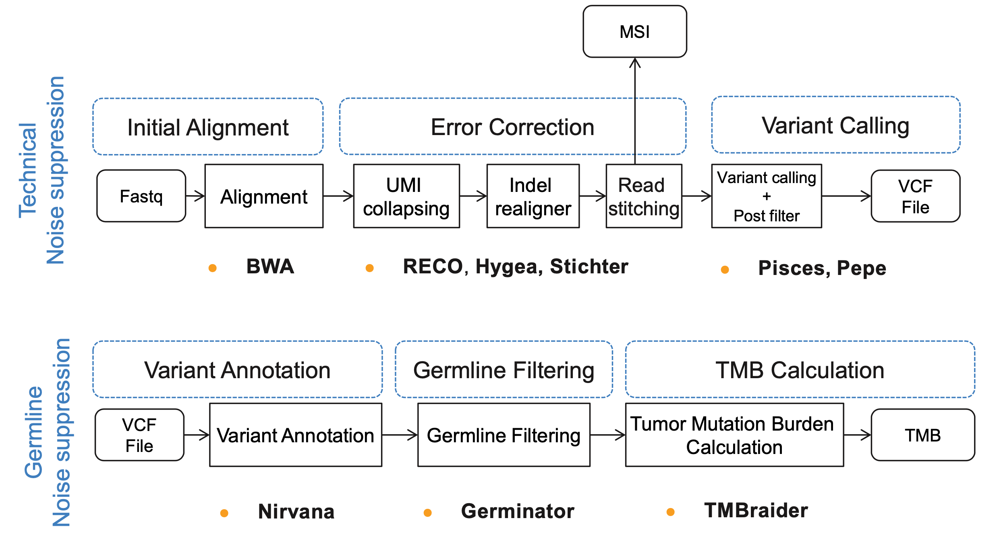

## TSO500分析流程解析

**FASTQ Generation**

**Workflow**

**Database**

**TMB**

**CNV**

**DNA Analysis Methods**

    DNA Alignment and Realignment
        使用BWA-MEM软件，此外还进行了第二轮比对，第二轮比对仅使用only unique molecular identifier (UMI) collapsed reads.
   
    Read Collapsing
        去冗余并对比对结果文件加标签：
        RX/XU—UMI   
        XV—Number of reads in the family.
        XW—Number of reads in the duplex-family, or 0 if not a duplex family.
    
    Indel Realignment and Read Stitching
        Gemini软件局部indel重比对,双端read拼接和reads过滤在比对结果中加入标签：
        XD—For successfully stitched reads only. Directional support string indicating forward, reverse, and stitched positions.
        XR—For successfully stitched reads only. Pair orientation (FR or RF).
    
    Small Variant Calling
        Pisces软件使用上一步的输出也就是StitchedRealigned进行变异检测
        
    Small Variant Filtering
        Pepe软件对变异检测进行过滤
        
    Copy Number Variant Calling
        CRAFT软件实施copy数变异检测，如果检测到异常在最终检测结果中带有<DUP>或<DEL>标签，注意对于<DEL>的检测算法还不成熟标签是LowValidation不是PASS
        
    Phased Variant Calling
        Scylla来处理MNV形成MNV结果
        
    Variant Merging
        结果合并
    Annotation
        Nirvana软件进行注释，该软件内核是VEP
        
    Tumor Mutational Burden
        1：excludes any variant with an observed allele count ≥10 in any of the GnomAD exome, genome, and 1000 genomes database. 
        2：To filter germline variants that are not observed in the database, the software identifies variants on the same chromosome with an allele frequency within a certain range
        3：If a given variant is not filtered out based on occurrence in the databases, variants on the same chromosome with similar allele frequencies will be grouped, and if 5 or more similar variants are found to have been filtered, the variant of interest is removed from the TMB Calculation. 
        4：Additionally, variants with an allele frequency ≥ 90% are removed from the TMB calculation as well.
        TMB = Eligible Variants / Effective panel size
        Eligible Variants (numerator)
                    • Variants not removed by the filtering strategy. • Variants in the coding region (RefSeq Cds)
                    • Variant Frequency >= 5%
                    • Coverage >= 50X
                    • SNVs and Indels (MNVs excluded)
                    • Nonsynonymous and synonymous variants
                    • Variants with COSMIC count >= 50 excluded
        Effective Panel Size (denominator)
                     • Total coding region with coverage > 50X
                     • Excluding low confidence regions in which variants are not called
    Microsatellite Instability Status
        TSO500专门有自己设计的130个MSI位点
        
    Contamination Detection
        TSO500专门找到了common snp约2192多个，其在一个样本的正常频率应为：0%, 50%, or 100%.
        在一个样本中收集这些频率在< 25% or > 75%的common snp位点，使用极大释然函数计算在一个样本中出现该情况的概率